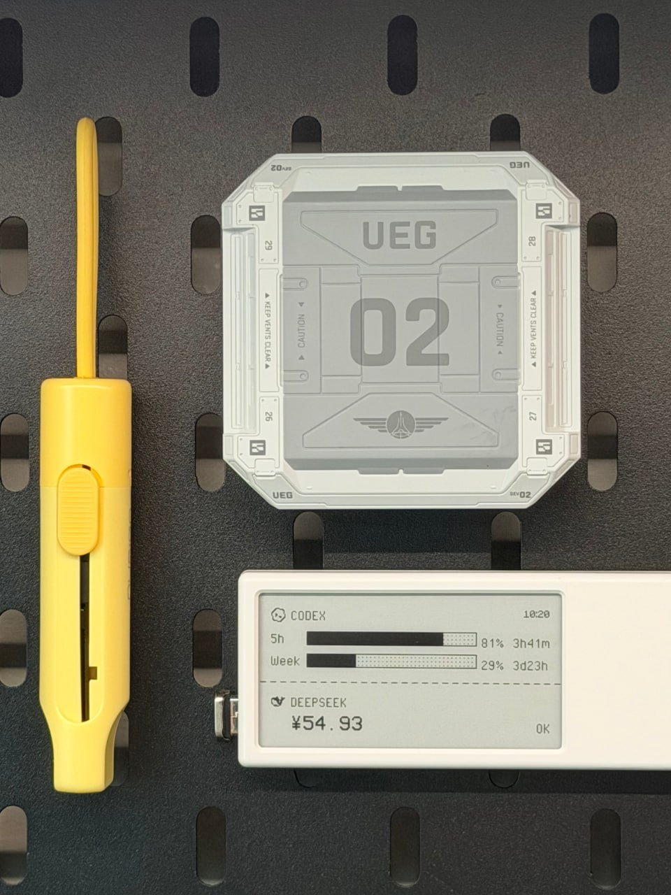
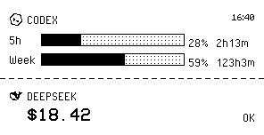

# quote0-burnout

Minimal AI usage dashboard for MindReset Quote/0 — OpenAI Codex + DeepSeek on e-ink.





## Current Layout (v0.6)

```
                        16:40
◆ CODEX
5h  [████████████░░░░░] 89%  4h41m
Week [████████░░░░░░░░] 69%  5d23h
─ ─ ─ ─ ─ ─ ─ ─ ─ ─ ─ ─ ─ ─
◆ DEEPSEEK
$18.42                        OK
```

- **Codex**: two rows (5h / Week) each with inline dot-grid progress bar. Bar fills = remaining%, text = remaining% + reset countdown.
- **DeepSeek**: balance in VCR OSD Mono 21px + status badge, bottom-aligned.
- **Fonts**: PixelOperator 16px (labels, rows, status), VCR OSD Mono 21px (balance), Minecraftia 8px (timestamp).
- **Divider**: 6px dash / 4px gap.
- **Time format**: ≥24h → XdXXh (e.g. 5d22h).

## How Codex data is fetched

Direct OAuth API call — **no CLI dependency**:

```
GET https://chatgpt.com/backend-api/wham/usage
Authorization: Bearer <token>
ChatGPT-Account-Id: <account_id>
```

Token auto-reads from `~/.codex/auth.json` (set by `codex` CLI login).
Override with `CODEX_ACCESS_TOKEN` + `CODEX_ACCOUNT_ID` env vars.

## Install

```bash
pip install -r requirements.txt
# Ensure codex CLI is authenticated (one-time):
codex
```

## Configure

```bash
cp config.example.env .env
# edit .env with your keys
source .env
```

### Required vars

| Variable | Required | Description |
|----------|----------|-------------|
| `QUOTE0_API_KEY` | Yes | Quote/0 API key |
| `QUOTE0_DEVICE_ID` | Yes | Quote/0 device ID |
| `QUOTE0_IMAGE_TASK_KEY` | No | taskKey for Image API slot (only with multiple cards) |
| `DEEPSEEK_API_KEY` | No | DeepSeek API key |
| `CODEX_ACCESS_TOKEN` | No | Override Codex OAuth token (auto-read from ~/.codex/auth.json) |
| `CODEX_ACCOUNT_ID` | No | Codex account ID for ChatGPT-Account-Id header |
| `QUOTE0_REFRESH_NOW` | No | Force immediate display (`true` for manual, `false` for scheduled) |

### Dot. App setup

In Content Studio, add a single **Image API content** card to the device task.
Keep only one IMAGE_API card — the script pushes without `taskKey`.

## Usage

```bash
# Preview — render PNG locally, no push
python display.py --preview

# Push to device
python display.py

# Self-check — test everything without pushing
python display.py --check

# Debug — print snapshot JSON
python display.py --debug-json

# List task slots
python display.py --list-tasks
```

## Schedule (macOS launchd)

Copy `scripts/com.ajax.quote0-burnout.plist.example` to `~/Library/LaunchAgents/`,
edit the `Program` path, then:

```bash
launchctl load ~/Library/LaunchAgents/com.ajax.quote0-burnout.plist
```

Runs every 5 minutes at :00, :05, :10...

## Troubleshooting

**Push returns 404 "未找到图像 API 内容"**

1. Dot. App → Content Studio
2. Remove all IMAGE_API cards from the device task
3. Re-add a single IMAGE_API card
4. Verify: `python display.py --list-tasks`

**Codex shows "no auth"**

Your `~/.codex/auth.json` is missing or expired. Run `codex` to re-authenticate,
or set `CODEX_ACCESS_TOKEN` in `.env`.

**Display doesn't update on schedule**

- `launchctl list | grep quote0`
- If stuck, kickstart: `launchctl kickstart gui/$(id -u)/com.ajax.quote0-burnout`

**Run `--check` to diagnose**

```bash
python display.py --check
```

Shows: env vars, Codex auth + API status, DeepSeek balance, rendering, and Quote/0 connectivity.
